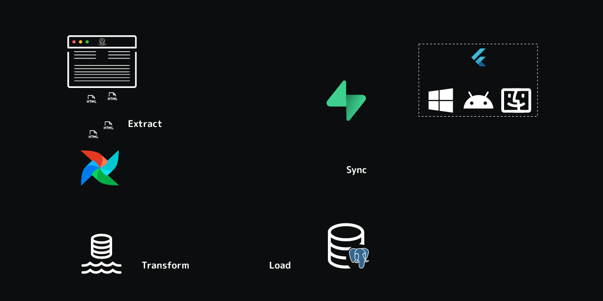
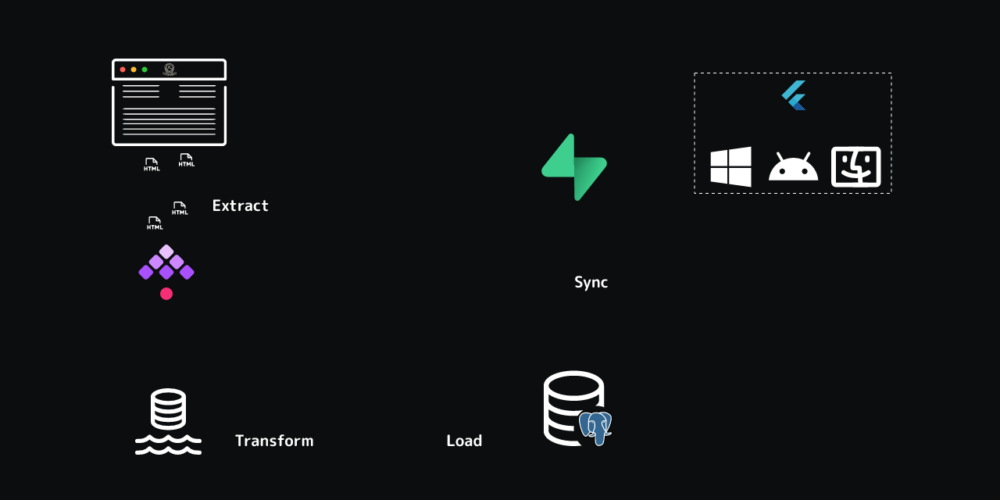

# Pipeline Automation

## Overview

Automation of the Data Engineering Pipeline was essential to reduce manual effort and improve reliability.

## Tools Evaluated

| **Tool** | **Strengths** | **Weaknesses** |
|------|-----------|------------|
| **Apache Airflow** | Mature ecosystem, rich UI | Complex setup, resource heavy |
| **Kestra** | YAML-based workflows, modern UI | Newer tool, smaller community |

=== "Apache Airflow"
    

=== "Kestra"
    

## Implementation

- Pipelines defined as **YAML workflows** in Kestra for ease of maintenance
- API calls to FastAPI pipeline services orchestrated sequentially
- All components containerized in **Docker** for consistent environments
- **Docker Compose** setup links scrapers, databases, pipeline APIs, and workflow engines

## Results

- Reduced pipeline execution time from 60+ minutes to 9 minutes
- Improved reliability with automated retries and notifications on failure
- Simplified maintenance via version-controlled workflow configurations

---

!!! abstract "Reliable. Efficient. Consistent."
    Automated execution ensures every stage runs reliably and efficiently, leading to consistent data quality and fast analytics update.
