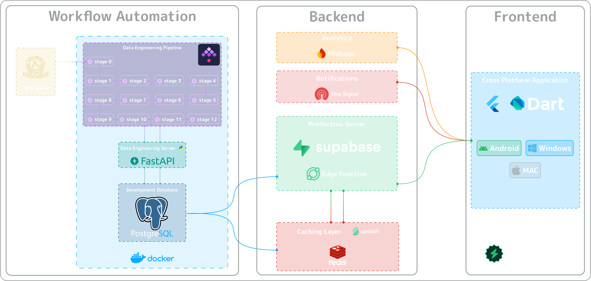
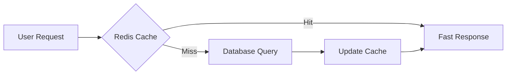

# System Architecture

## Architectural Philosophy

OuSpark was designed with a **microservices inspired architecture** that prioritizes scalability, performance, and maintainability. Our solution addresses each [identified problem](./problem-statement.md) through targeted technological interventions.

---

## High-Level Architecture

---

## Core Components Overview

### 1. Data Acquisition Layer

| **Component** | **Technology** | **Purpose** |
|-----------|------------|---------|
| **Web Scraper** | Python + Custom Algorithms | Ultra-fast result extraction (10K+ results in 5 min) |
| **Data Validation** | Pydantic + Custom Logic | Ensure data integrity and consistency |

### 2. Processing & Storage Layer

| **Component** | **Technology** | **Purpose** |
|-----------|------------|---------|
| **ETL Pipeline** | 14 Stages (FastAPI) | Transform raw data into actionable insights |
| **Development DB** | PostgreSQL | Local processing and validation |
| **Production DB** | Supabase PostgreSQL | Live application data store |

### 3. Performance Layer

| **Component** | **Technology** | **Purpose** |
|-----------|------------|---------|
| **Caching** | Redis (Upstash) | 90% reduction in I/O bandwidth |
| **Edge Functions** | Supabase Edge | Optimized API responses |
| **CDN** | GitHub Pages | Static asset delivery |

### 4. Application Layer

| **Component** | **Technology** | **Purpose** |
|-----------|------------|---------|
| **Cross-Platform App** | Flutter + Dart | Unified experience across platforms |
| **UI/UX Design** | Figma + Lottie/Rive | Professional, animated interfaces |

---

### Technology Stack Rationale

#### Frontend Decision

| **Criteria** | **Flutter** | **React Nativ** | **Native** |
|----------|---------|--------------|---------|
| **Cross-Platform** | ✅ Excellent | ✅ Good | ❌ Platform-specific |
| **Performance** | ✅ Near-native | ⚠️ Good | ✅ Best |
| **Development Speed** | ✅ Fast | ✅ Fast | ❌ Slow |
| **Supabase Integration** | ✅ Excellent | ✅ Good | ⚠️ Manual |
| **Team Expertise** | ✅ High | ⚠️ Medium | ❌ Limited |

**Decision**: Flutter selected for optimal cross-platform development with strong Supabase integration.

---

#### Backend Decision

| **Criteria** | **Supabase** | **Firebase** | **Custom Backend** |
|----------|----------|----------|----------------|
| **PostgreSQL Support** | ✅ Native | ❌ No | ✅ Manual Setup |
| **Real-time Features** | ✅ Built-in | ✅ Built-in | ❌ Custom Implementation |
| **Scalability** | ✅ Automatic | ✅ Automatic | ⚠️ Manual |
| **Cost Efficiency** | ✅ Good | ⚠️ Can be expensive | ❌ High maintenance |
| **JSON Support** | ✅ JSONB | ⚠️ Document-based | ✅ Manual |

**Decision**: Supabase chosen for PostgreSQL compatibility with JSON support and comprehensive BaaS features.

---

#### Caching Architecture

---

### Database Technology

| **Database** | **Pros** | **Cons** | **Decision** |
|----------|------|------|----------|
| **MySQL** | ✅ Familiar, reliable | ❌ Limited JSON support | ❌ Rejected |
| **SQLite** | ✅ Simple, file-based | ❌ Not suitable for concurrent access | ❌ Rejected |
| **MongoDB** | ✅ JSON-native, flexible | ❌ No SQL for analytics | ❌ Rejected |
| **PostgreSQL** | ✅ SQL + JSONB support | ✅ Perfect fit | ✅ **Selected** |

---

!!!tip "*This architecture enables OuSpark to handle massive scale while maintaining excellent performance and user experience across all platforms.*"
