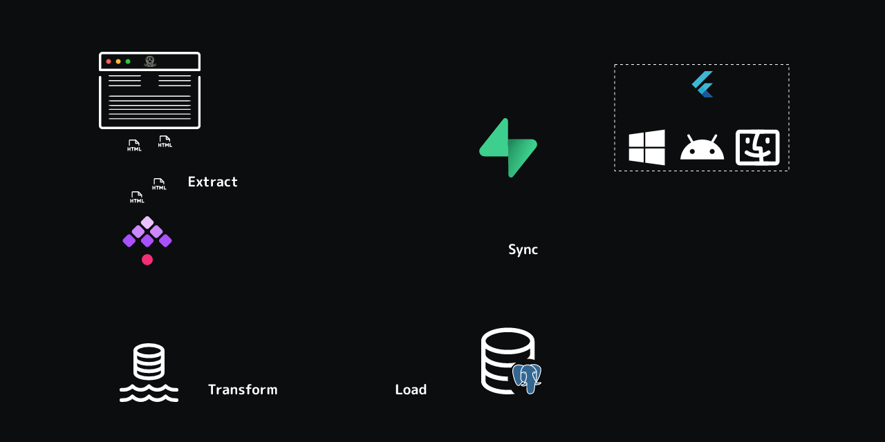

# Data Engineering Pipeline Architecture

## Overview

The Data Engineering Pipeline is the core engine that processes raw results data into actionable insights, powering the OuSpark analytics system.

## Pipeline Design

- Implemented as **14 sequential stages (Stage 0 to Stage 13)** representing Extraction, Transformation, Loading, Syncing, and Caching processes
- Each stage is exposed as a **FastAPI standalone microservice**
- Pipeline maintains a **development PostgreSQL database** for local processing before syncing to production

## Stages Summary

| **Stage** | **Description** |
|-------|-------------|
| **Stage 0** | Ultra-fast HTML scraping from OU website (10k+ results in ~5 min) |
| **Stage 1** | Extract, clean and load data into development PostgreSQL |
| **Stages 2-11** | Analytics computation: rankings, credits, CGPAs, demographics, semester, subject, college, and department stats |
| **Stage 12** | Synchronize processed data with production Supabase PostgreSQL |
| **Stage 13** | Flush and prewarm Redis cache with updated analytics |

## Pipeline Automation

- Automated execution of pipeline stages using **Kestra** (YAML-configured workflows) preferred due to UI and maintainability advantages
- Also supports **Apache Airflow** for DAG-based orchestration
- All services containerized using **Docker** and linked via **Docker Compose**

## Pipeline Workflow Diagram

=== "Apache Airflow"
    

=== "Kestra"
    

## Performance Outcomes

- Entire pipeline runs end-to-end in approximately **9 minutes** compared to over 1 hour previously
- Automation eliminates human errors and manual intervention
- Scalability enabled by containerization and parallelizable API architecture

---

!!! success "*This pipeline architecture is a critical component enabling OuSpark's real-time, scalable analytics capabilities.*"

!!!danger "FastAPI-Powered Stable Architecture"
    APIs for each stage are implemented using FastAPI. A dual-database (dev and prod) approach ensures reliability and quick recovery from errors.
