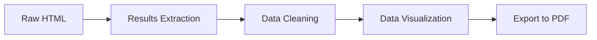
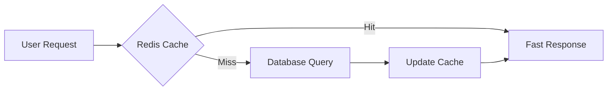
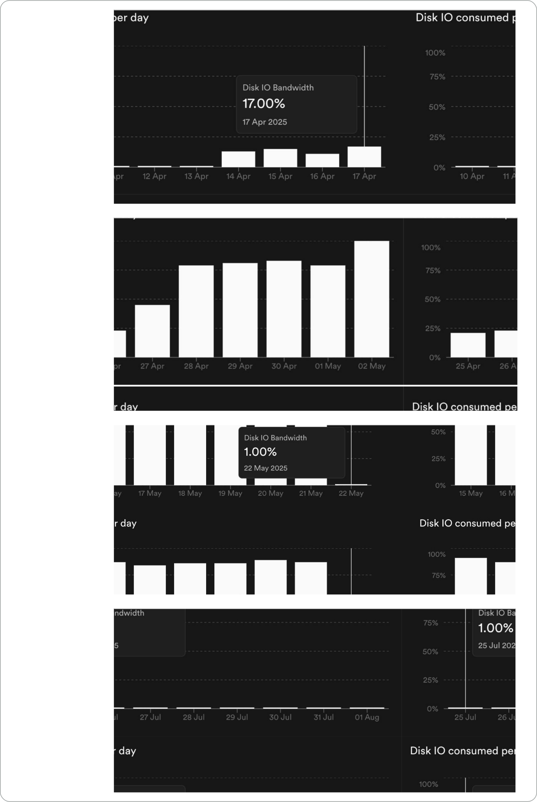

# Project History & Evolution

The **OuSpark** project evolved through multiple phases, each addressing growing requirements and technical challenges. This journey showcases how a simple idea transformed into a comprehensive result analytics platform.

## Phase 1: Basic scraping and analysis

**Tools Used:**

- Python (requests, BeautifulSoup, pandas)
- Matplotlib for basic visualization
- Jupyter Notebook for development
- CSV files for data storage

!!! success "**Achievements:**"

    - ✅ Basic result extraction
    - ✅ Pass/fail ratio calculation
    - ✅ Subject-wise performance analysis
    - ✅ Simple student rankings

---

## Phase 2: Architectural Improvements

**New Technologies:**

- **Streamlit**: Interactive web application
- **ydata-profiling**: Advanced data analysis
- **Nivo Charts**: Interactive visualizations
- **PDF Export**: Shareable reports

!!! success "**Key Learnings:**"

    - Importance of separation of concerns
    - Need for interactive interfaces
    - Value of exportable analytics

### Streamlit Webapp UI:

<!-- <video style="width:100%" muted="" controls="" alt="type:video">
   <source src="../assets/videos/ResultAnalyzerDemo.mp4" type="video/mp4">
</video> -->

---

## Phase 3: Scalable Tech Stack

**Requirements:**

- Cross-platform deployment (Mobile + Desktop)
- Stable production performance
- Good integration with chosen backend

!!! abstract "**Final Stack Decision:**"

    - [Frontend:](../SystemArchitecture/frontend.md) Dart (Flutter)
    - [Backend:](../SystemArchitecture/backend.md) Supabase (PostgreSQL + Auth + Storage)
    - [Pipeline:](../SystemArchitecture/pipeline.md) Python (FastAPI), YAML, Airflow, Kestra, Docker.

---

## Phase 4: [UI/UX Design](../SystemArchitecture/frontend.md)

!!! danger "**Before:**"

    - Basic Streamlit interface
    - Limited customization
    - Poor mobile experience

!!! success "**After:**"

    - Professional [Figma designs](../SystemArchitecture/frontend.md/#uiux-design-process)
    - Custom animations (Lottie + Rive)
    - Mobile-first approach
    - Consistent branding

<!--  -->

<iframe  width="700" height="393"
    src="https://www.youtube.com/embed/1_JopwufiNY"
    title="YouTube video"
    frameborder="0"
    allow="accelerometer; autoplay; clipboard-write; encrypted-media; gyroscope; picture-in-picture; web-share"
    referrerpolicy="strict-origin-when-cross-origin" 
    allowfullscreen>
</iframe>

---

## Phase 5: Performance Optimization ⚡

**Problem**: CPU utilization reached ~70% daily due to heavy read operations

**Investigation Results:**

- Search Results was the most-used feature (Firebase Analytics insight) in the app.
- Heavy database I/O was causing bottlenecks

### Solution Architecture

!!! abstract "**Implementation:**"

    - **Redis Integration**: Upstash serverless Redis
    - **Supabase Edge Functions**: Custom caching logic
    - **Prewarming Strategy**: Populate cache proactively

!!! success "**Results:**"

    - 📊 **Disk I/O**: 90% → 1% reduction
    - ⚡ **Response Time**: Significantly improved
    - 🎯 **User Experience**: Seamless and fast

## Phase 6: [Pipeline Automation](../AutomationDevOps/automation.md)

**Challenge**: Manual pipeline execution was error-prone and time-consuming

**Solutions Evaluated:**

### Apache Airflow

- **DAG-based** workflow definition
- Sequential task execution
- **Pros:** Mature, well-documented  
- **Cons:** Complex setup, heavy resource usage

### Kestra

- **YAML-based** workflow definition
- Sequential API call to execute pipeline
- **Pros:** YAML configuration, better UI  
- **Cons:** Newer technology, smaller community

**Final Choice**: Both tools were implemented, with Kestra preferred for its superior UI and YAML-based configuration.

!!! success "**Performance Improvements Over Time**"

    | **Metric** | **Phase 1** | **Phase 2** | **Phase 6** | **Improvement** |
    |--------|---------|---------|---------|-------------|
    | **Processing Time** | 1+ hour | 1+ hour | 9 minutes | **85% faster** |
    | **Result Extraction** | Manual | 1 hour | 5 minutes | **92% faster** |
    | **Concurrent Users** | 1 | ~10 | 200+ | **200% increase** |
    | **Platform Support** | 1 (Jupyter) | 1 (Web) | 3 (Mobile/Desktop/Web) | **300% increase** |

---

!!!tip "*This evolution demonstrates how thoughtful technology choices and iterative development can transform a simple concept into a robust, scalable platform serving thousands of users.*"
